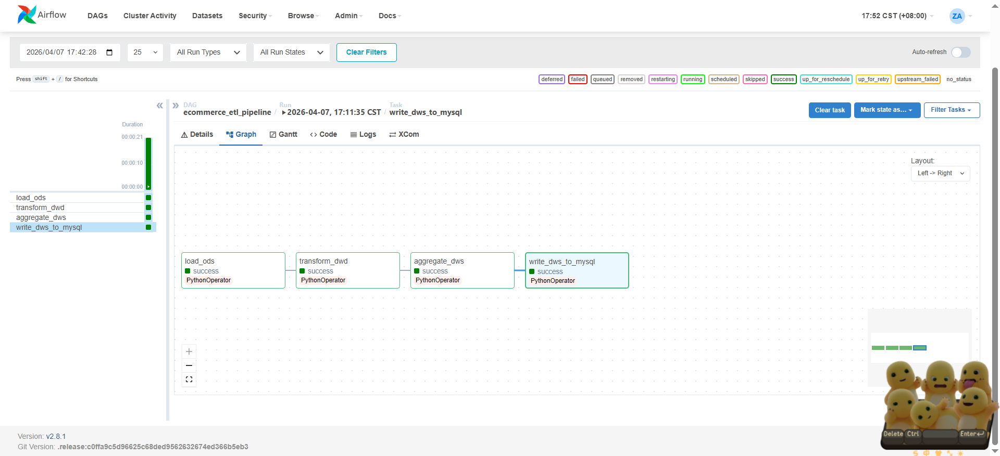
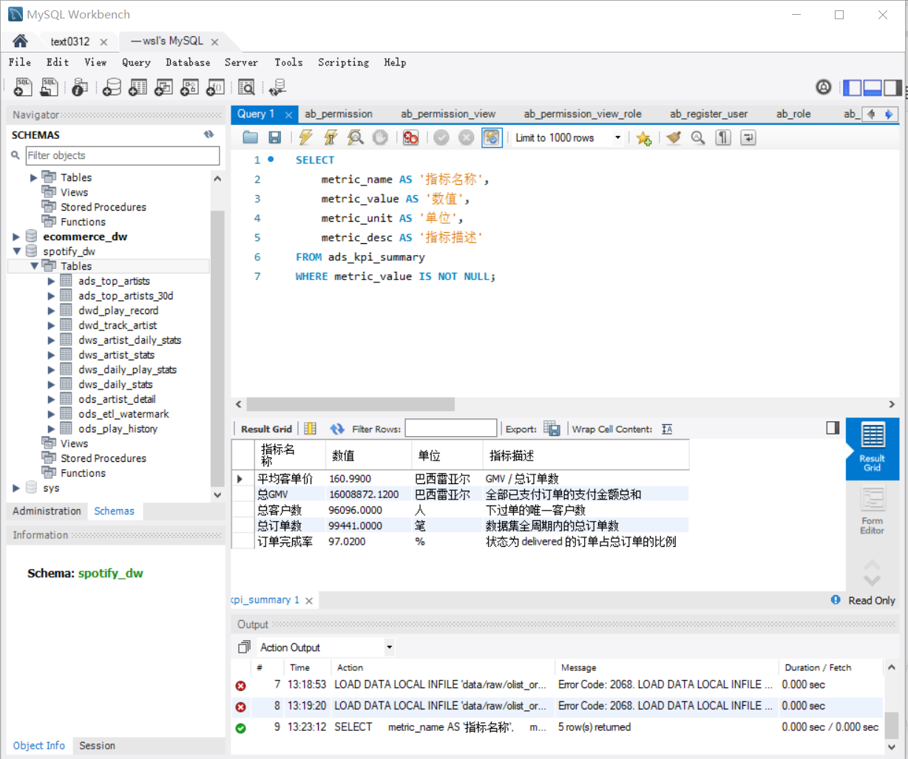
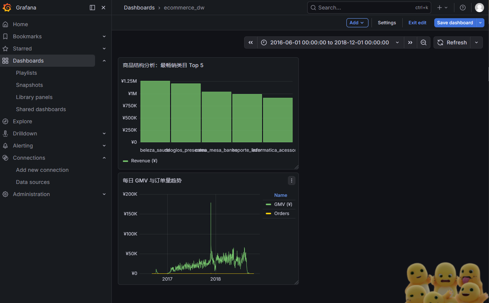

# E-commerce User Behavior Data Platform

> A distributed data processing platform built on a real-world Brazilian e-commerce dataset (100k+ orders). It leverages **PySpark** for multi-table joins and million-row aggregations, features a **three-tier metrics system**, and is fully orchestrated via **Apache Airflow**.

## 🛠 Tech Stack

| Module | Technologies |
| :--- | :--- |
| **Distributed Computing** | PySpark 3.5 · SparkSQL · Parquet (Columnar Storage) |
| **Data Storage** | MySQL 8.0 · Medallion Architecture (ODS / DWD / DWS / ADS) |
| **Metrics System** | Atomic / Derived / Composite Metrics Design |
| **Orchestration** | Apache Airflow 2.8 · 4-Node Directed Acyclic Graph (DAG) |
| **Visualization** | Grafana |

## 📊 Dataset

**Brazilian E-Commerce Public Dataset** (by Olist on Kaggle)

* **Total Orders:** 99,441
* **Total Customers:** 96,096
* **Schema:** 7 Relational Tables
* **Time Span:** 2016 — 2018
* **Pipeline Flow:** Original CSV → PySpark Processing → Parquet Storage

---

## 🏗 Data Processing Architecture

1.  **ODS Layer:** `data/raw/*.csv` → **PySpark ODSLoader** → `output/ods/*.parquet` (7 Tables)
2.  **DWD Layer:** **PySpark DWDTransformer** (Multi-table JOINs & Wide Table Construction) → `output/dwd/order_wide.parquet`
3.  **DWS Layer:** **SparkSQL DWSAggregator** (Grouped Aggregations) → `output/dws/daily_stats` & `category_stats`
4.  **ADS Layer:** **MySQL Writer** (Parquet to MySQL) → **MetricsCalculator** (6 core KPIs) → `ads_kpi_summary`
5.  **Visualization:** **Grafana** Dashboards

---

## 🚀 Airflow Workflow (DAG)

The pipeline consists of 4 task nodes with linear dependencies. Metrics calculation is triggered in MySQL only after all upstream Spark jobs succeed.



| Task | Description |
| :--- | :--- |
| `load_ods` | Reads 7 CSVs via PySpark and persists as Parquet files. |
| `transform_dwd` | Performs complex JOINs; calculates `delivery_days` and `is_late_delivery`. |
| `aggregate_dws` | Aggregates data by Date/Category via SparkSQL; calculates GMV and completion rates. |
| `write_to_mysql` | Loads Parquet into MySQL via Pandas, triggering final ADS & KPI generation. |

---

## 📈 Core Business Metrics



| Metric | Value | Description |
| :--- | :--- | :--- |
| **Total GMV** | 16,008,872 BRL | Total amount of all paid orders. |
| **Total Orders** | 99,441 | Total volume within the dataset period. |
| **Total Customers** | 96,096 | Number of unique customers who placed orders. |
| **AOV (Avg. Order Value)** | 160.99 BRL | GMV / Total Orders. |
| **Order Success Rate** | 97.02% | Percentage of orders with "delivered" status. |

### 🎨 Visualization Dashboard (Grafana)



**Business Insights:**
* **Top Category:** `beleza_saude` (Beauty & Health) leads in total sales volume.
* **Growth Trend:** GMV saw a significant peak in 2018, likely driven by promotional events or market expansion.

---

## 📐 Metrics Framework Design

* **Atomic Metrics (Raw Counts)**
    * Total Orders, Total GMV, Total Unique Customers.
* **Derived Metrics (Calculated)**
    * `AOV` = GMV / Order Count
    * `Success Rate` = Delivered Orders / Total Orders
    * `Avg Delivery Days` = AVG(Arrival Date - Order Date)
* **Composite Metrics (Complex Dimensions)**
    * `30-Day Retention` = Customers with ≥2 purchases / Total Customers.
    * `Late Delivery Rate` = Orders where Actual Arrival > Estimated Arrival.

---

## ⚡ Quick Start

### 1. Clone the Project
```bash
git clone [https://github.com/Zaya-M/Ecommerce-ETL-Pipeline-PySpark.git](https://github.com/Zaya-M/Ecommerce-ETL-Pipeline-PySpark.git)
cd Ecommerce-ETL-Pipeline-PySpark